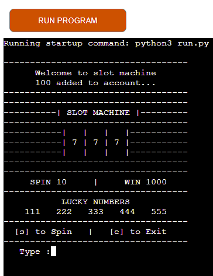
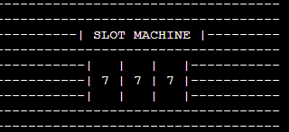
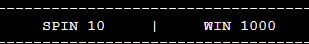
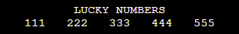
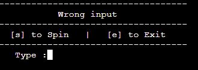
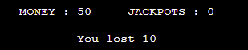
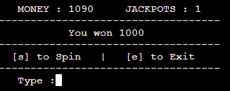
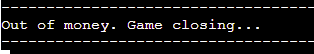
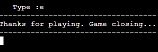

## SLOT MACHINE

It's a Python terminal game, wich runs in the Code Institute mock terminal on Heroku. 

The slot machine is a very simple game, but with great experience to the user. The goal is to get as many jackpots as possible and don't lose all your money.

[Here is the link to live version of project](https://slot-machine.herokuapp.com/)

## How to play

There are only two options to choose for the player. Typing s which is triggering spin or typing e which is closing the game. 
User can keep repeating till hitting a jackpot or losing money.

## Existing Features

* In the center of the game slots are displayed  which are numbers, after hitting a spin they are randomly changed.

* User clearly sees what it cost for a spin and what can gain if hit a jackpot.

* Winning numbers are displayed in the menu, gives user ability understand what the winning numbers are.

* In user menu shows two options to spin using s button and hitting enter, and e button to close the game.

* If the user chose to enter different buttons to console, gonna be rewarded with an error message.

* After hitting spin first time, in the menu show up new panel which shows the user money count and many jackpots user hits.

* Jackpots are rewarded by message user won and its show up in jackpot count.

* When money is depleted, out of money message shows up and the game closes.

* If user decides end game and enters e button, thanks for playing message appears.

## Future Features

* Allow player chose difficulity
* Include Highscore leaderboard

## Data Model

For this project I decided to use RNG which is stands for random number generator, RNG does not use any form of memory to determine what number should be generated. Slots are generated randomly and displayed to the user. This  project made using while loop backing with if, elif, else statements.
Used few variables to store data as money count and jackpots. User input was limited to two options button [s] and [e], to spin or exit, typed something else would trigger wrong input message.

## Testing

* Tested in my local terminal and Code Institute Heroku terminal
* Tested through a Code Institute PEP8 linter and confirmed there are no problems

## Bugs

* When deploying to heroku give an error, library can't be install.
fixed : removed unused library from requirements.txt

* fixed some typos in welcome message
* console clear function was giving and erro, becouse was using windows function os.system('cls').
fixed : changed to os.system('clear')

## Deployment

This project was deployed using Code Institute's mock terminal for Heroku.

* Steps for deployment:
  * Clone this repository
  * Create new Heroku app
  * Set port 8000 to config in settings section.
  * Set the buildpacks to Python and Nodejs in that order
  * Link Heroku app to the repository
  * Click on Deploy

## Credits

* Code Institute for the deployment terminal
* Wikipedia for the details of the Slot Machine